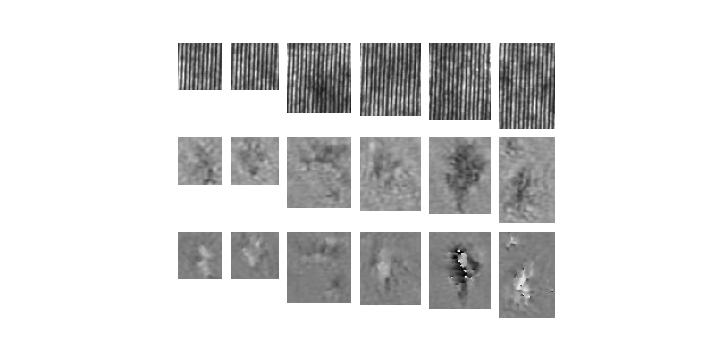
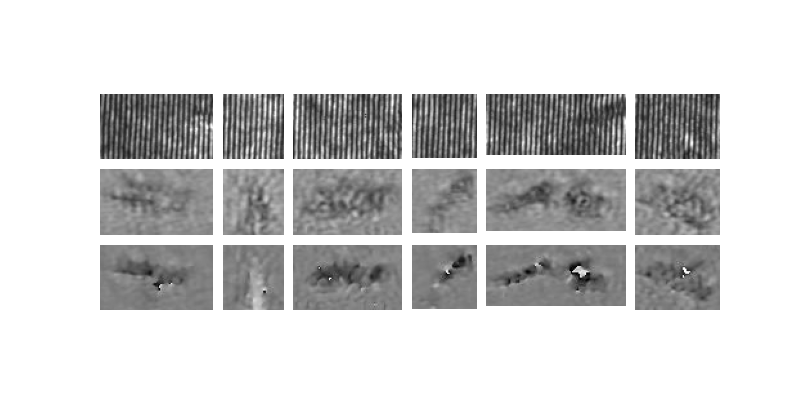

# HDMP

HMPD is a large sized dataset of microplastic/non-microplastic images retrieved by the analysis pipeline in figure below and labeled by and experts. 
The employed water sample comes from an aliquot of wastewater from a washing test of polyester textiles in a commercial washing machine.


The dataset can be downloaded here: [DOWNLOAD HDMP](https://cnrsc-my.sharepoint.com/:u:/g/personal/marco_delcoco_cnr_it/ES1QHea7vIlFpUC8Ev9qsnIBU5bi7VX1VF_S1HBR5pgriw?e=k2iByS?download=1)
Last Update: 28 April 2023


## The dataset

The object detection process extracted 11285 objects, and for each of them, raw, amplitude and phase have
been saved as patches. An expert operator took care of the annotation that has been performed on 3 category: microplastic (2974), non-microplastic (7490) and
possible-microplastics (813).

Two version of the dataset are provided:
- HMPD has been made considering all the 2974 positive samples and 2974 negative samples, randomly selected among the non-microplastic (gt.csv).
- HMPD-P includes the possible-microplastics occurrences as positive samples. It counts 3783 positive and 3783 random negative samples (gt_possible.csv). 

Each sample is provided with all the three components (raw, amplitude and phase). Some examples are reported in figure below.



Non Microplastis patche examples (the raw show respectively raw, amplitude and phase components)



Microplastis patch examples (the raw show respectively raw, amplitude and phase components)

In order to enable fairest comparison betwen methodologies we provided a static folding split that can be found in the  `staticFoldGenerator` folder.

# Banchmark

## Installation

```
pip install -r requirements.txt
```

## Run a banckmark

The banchmark parameter can be set-up by means a configuration file.
You can fine an example in `./config/customConf.yaml` that will be the default one in case a specific file will not be provided.
Configuration file also include the list of network you intend to test. Currently the available Networks are:
- Alexnet (alexnet)
- VGG 11 (vgg11)
- ResNet18 (resNet18)
- Mobilenetwork V2 (mobilenet_v2)

In order to run the experiment:

```
python banckmark.py --device gpu --name newtest --config ./config/costuomConf.yaml --dataset <basepath>/Microplastiche/images --gt <basepath>/gt.csv
```

- *--name* It is the name of the current experiment. A subfolder with the experiment name will be created in *tests* folder and will contains all the results. (mandatory parameter)
- *--dataset* It is the path of the dataset (mandatory parameter)
- *--gt* It ts the path of the csv ground truth.
- *--config* It is the path of the configuration file.
- *--device* default is *cpu*, but *gpu* (Nvidia Cuda) or *mps* (M1 gpu) can be selected.

## Run a banckmark

In order to run the banckmark with a given train/test split the `banckmark_staticFolds.py` can be used. It works like the standard `banckmark.py` previously
introduced. The only difference is in the `--gt` parameter dat this time must be a folder containing, for each channel, 5 ground truth train and test file in the following form
```
├── GT
│   ├── A
│   │   ├── train_0.csv
│   │   ├── test_0.csv
│   │   ├── ...
│   │   ├── train_4.csv
│   │   ├── test_4.csv
│   ├── P
│   │   ├── train_0.csv
│   │   ├── test_0.csv
│   │   ├── ...
│   │   ├── train_4.csv
│   │   ├── test_4.csv
│   ├── R
│   │   ├── ...
│
├── GT_P
│   ├── A
│   │   ├── train_0.csv
│   │   ├── test_0.csv
│   │   ├── ...
│   │   ...
```
The processing can be run with the following command. The `--gt` will be provided for example with the path to the folder `GT`
```
python banckmark_staticFolds.py --device gpu --name newtest --config ./config/costuomConf.yaml --dataset <basepath>/Microplastiche/images --gt <basepath_folding_files>
```

## Generate report
`report.py` allows to generate a report of the run banckmarks. It will returns ROC curves plots and accuracy of each network.

```
python report.py --name newtest 
```


## Inference

Banckmark automatically save the models for each fold. Such models can be easly used for inference.
```
 python predict.py --model ./trainedModels/model.pt --image ./imges/img.bmp
```

## Statistics
The script `statistic.py` returns the statistics in terms of images dimension for a given subset provided with the groundtruth.


